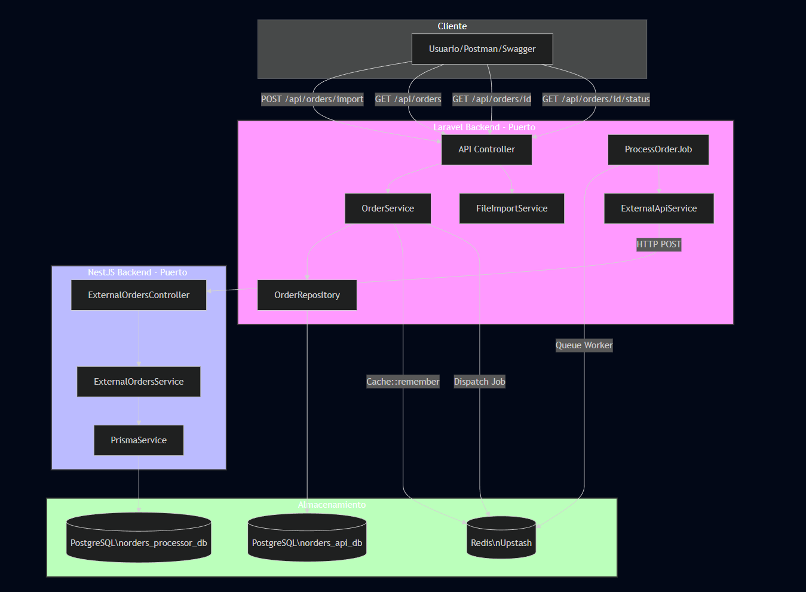
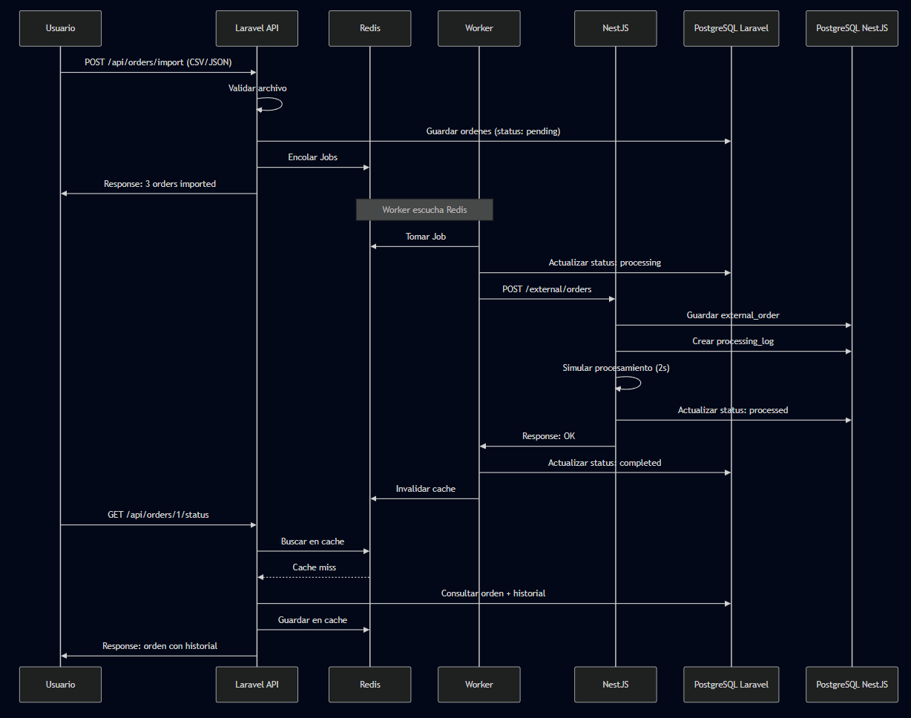
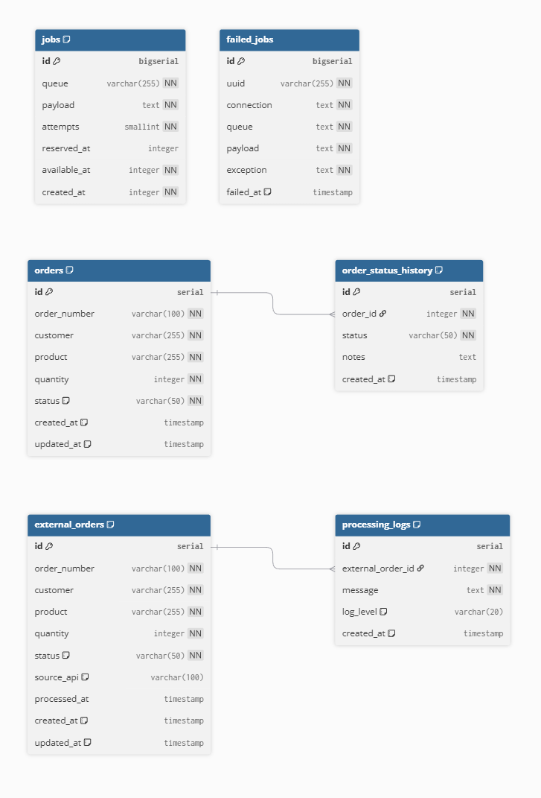

<p align="center"><a href="https://laravel.com" target="_blank"></a></p>


# Laravel API – Gestión de Órdenes

El objetivo de esta API es gestionar órdenes de manera eficiente y escalable.  
Permite:
- Procesamiento masivo de órdenes desde archivos CSV o JSON.
- Validación de datos y persistencia en PostgreSQL.
- Procesamiento asíncrono mediante Jobs y colas.
- Comunicación con un servicio externo NestJS para procesamiento especializado.
- Cacheo de listados y estados de órdenes usando Redis.

---

###  Tabla de Contenidos
1. [ Tecnologías principales](#-tecnologías-principales)
2. [ Requisitos del sistema](#-requisitos-del-sistema)
3. [ Instalación y Configuración](#-instalación-y-configuración)
4. [ Guía de Uso de la API](#-guía-de-uso-de-la-api)
5. [ Arquitectura](#-arquitectura)
6. [ Diagramas](#-diagramas)
7. [ Diccionario de Estados de la Orden](#-diccionario-de-estados-de-la-orden)
8. [ Troubleshooting (Resolución de Problemas)](#-troubleshooting-resolución-de-problemas)
---
### 🔹 Tecnologías principales
<details>
<summary>Laravel 12</summary>

- Framework PHP utilizado como **API principal y orquestador**.
- Maneja las rutas, controllers, services y repositories.
- Facilita la integración con Jobs y colas para procesamiento asíncrono.
- [Documentación oficial Laravel](https://laravel.com)
</details>
<details>
<summary>PostgreSQL</summary>

- Base de datos relacional utilizada para **persistencia de órdenes**.
- Soporta transacciones, índices y relaciones entre tablas.
- Optimizada para consultas de listados y detalle de órdenes.
- Ideal para escalar en volumen de datos.
</details>
<details>
<summary>Redis</summary>

- Sistema de cache en memoria para **listados y estados de órdenes**.
- Mejora la velocidad de respuesta de la API.
- Se utiliza para cachear consultas frecuentes y se invalida cuando cambia el estado de una orden.
- Permite integración fácil con Jobs y colas.
</details>
<details>
<summary>Jobs y colas</summary>

- Manejan el **procesamiento asíncrono de órdenes**.
- Permiten separar la recepción de las órdenes de su procesamiento pesado.
- Garantizan que la API responda rápidamente al usuario mientras las tareas se ejecutan en segundo plano.
- Se pueden configurar distintos “workers” y prioridades.
</details>
<details>
<summary>HTTP REST</summary>
- Comunicación con el **servicio externo NestJS** mediante peticiones HTTP.
- Uso de endpoints bien definidos para enviar órdenes y consultar estados.
- Facilita integración con otros sistemas o microservicios.
- Basado en estándares REST para mantener consistencia y escalabilidad.
</details>

---

### 🔹Requisitos del sistema

<details>
<summary>Requisitos</summary>

Para garantizar el correcto funcionamiento de la arquitectura distribuida, el entorno debe cumplir con las siguientes especificaciones técnicas:

###  Entorno de Desarrollo

#### Backend Principal (Laravel)
* **PHP:** `^8.2` (Versión mínima requerida por Laravel 12).
* **Composer:** Necesario para la gestión de dependencias definidas en el `composer.json`.
* **Extensiones PHP:** `openssl`, `pdo_pgsql`, `mbstring`, `tokenizer`, `xml`, `ctype`, `json`.


###  Infraestructura y Almacenamiento
* **PostgreSQL:** Versión `14.x` o superior. Se requieren dos bases de datos independientes para cumplir con el aislamiento de servicios:
    * `orders_api_db` (Instancia Laravel).
    * `orders_processor_db` (Instancia NestJS).
* **Redis (Upstash/Local):** Versión `6.x` o superior. Utilizado para la gestión de colas y caché mediante la librería `predis/predis`.

###  Herramientas de Apoyo
* **L5-Swagger:** Integrado para la documentación interactiva de la API.
* **Laravel Sail:** Opcional, para levantar el entorno completo mediante contenedores Docker.
* **Npx Concurrently:** Utilizado para ejecutar simultáneamente el servidor, los workers y el monitoreo de logs.

</details>

---

### 🔹 Arquitectura

<details>
<summary>Arquitectura del Sistema</summary>

El sistema está diseñado bajo una arquitectura distribuida que separa la gestión de la API del procesamiento intensivo de datos, asegurando alta disponibilidad y escalabilidad.

### Diagrama de Flujo y Arquitectura



---

###  Componentes del Sistema

#### 1. Capa de Cliente (Interfaz)
El sistema expone una interfaz RESTful consumible por **Postman**, **Swagger** o interfaces de usuario, a través de los siguientes endpoints:
* `POST /api/orders/import`: Carga masiva de datos.
* `GET /api/orders`: Listado de órdenes.
* `GET /api/orders/{id}`: Detalle de orden.
* `GET /api/orders/{id}/status`: Consulta de estado de procesamiento.

#### 2. Laravel Backend (Puerto de Entrada)
Encargado de la orquestación y la lógica de negocio principal:
* **API Controller:** Punto de entrada que delega a los servicios.
* **OrderService & FileImportService:** Gestionan la lógica de pedidos y la importación de archivos.
* **OrderRepository:** Capa de persistencia que interactúa con la base de datos principal.
* **ExternalApiService:** Gestiona la comunicación saliente vía **HTTP POST** hacia el microservicio de NestJS.
* **ProcessOrderJob:** Proceso asíncrono gestionado mediante **Queue Workers**.

#### 3. NestJS Backend (Procesamiento Externo)
Servicio especializado en el procesamiento de órdenes externas:
* **ExternalOrdersController & Service:** Reciben y procesan los datos enviados desde Laravel.
* **PrismaService:** Utilizado como ORM para la gestión de datos eficiente en su propia instancia de base de datos.

#### 4. Capa de Almacenamiento
* **PostgreSQL (`norders_api_db`):** Base de datos principal para el backend de Laravel.
* **PostgreSQL (`norders_processor_db`):** Base de datos dedicada para el procesador de NestJS.
* **Redis (Upstash):** Cumple una función dual:
    * **Caché:** Optimización de consultas mediante `Cache::remember`.
    * **Colas:** Gestión de mensajes para el `Dispatch Job` y el `Queue Worker`.

###  Notas Técnicas
* **Procesamiento Asíncrono:** La arquitectura permite que la API responda de inmediato al usuario mientras el trabajo pesado se realiza en segundo plano.
* **Estrategia de Caché:** Se reduce la carga en PostgreSQL utilizando Redis para los estados y listados de órdenes más consultados.
* **Desacoplamiento:** El uso de un repositorio y servicios independientes en Laravel permite cambiar la lógica de persistencia o de API externa con un impacto mínimo en el resto del código.

</details>

---

### 🔹 Diagramas

<details>
<summary>Diagrama de flujo de órdenes</summary>

El siguiente flujo detalla el ciclo de vida de una orden, desde su importación hasta su consulta final, destacando la interacción asíncrona entre servicios.

### Secuencia de Procesamiento


---

###  Descripción del Proceso

#### 1. Importación e Inicialización
* **Validación:** El usuario envía un archivo (CSV/JSON) a `POST /api/orders/import`, el cual es validado por la **Laravel API**.
* **Persistencia Inicial:** Las órdenes se guardan en **PostgreSQL Laravel** con estado `pending`.
* **Encolamiento:** Se despachan los Jobs a **Redis** para su procesamiento asíncrono, devolviendo una respuesta inmediata al usuario.

#### 2. Procesamiento Asíncrono (Worker)
* **Consumo de Job:** El **Worker** escucha a Redis y toma la tarea pendiente.
* **Cambio de Estado:** Actualiza el estado de la orden a `processing` en PostgreSQL Laravel.
* **Integración Externa:** El Worker realiza un `POST /external/orders` hacia el servicio **NestJS**.

#### 3. Operaciones en NestJS
* **Registro Externo:** NestJS guarda la `external_order` y crea un `processing_log` en **PostgreSQL NestJS**.
* **Simulación:** El servicio realiza una simulación de procesamiento (aprox. 2s).
* **Finalización Externa:** Actualiza el estado a `processed` en su propia base de datos y responde exitosamente al Worker de Laravel.

#### 4. Finalización e Invalidación
* **Estado Final:** El Worker de Laravel marca la orden como `completed`.
* **Sincronización de Caché:** El Worker solicita a **Redis** invalidar la caché para asegurar que las próximas consultas obtengan datos frescos.

#### 5. Consulta de Estado (Lectura)
* **Flujo de Cache Miss:** Al consultar `GET /api/orders/{id}/status`, Laravel busca primero en **Redis**.
* **Recuperación:** Si no existe (Cache miss), consulta la orden y su historial en **PostgreSQL Laravel**.
* **Optimización:** El resultado se guarda en **Redis** para futuras peticiones antes de responder al usuario.

</details>

<details>
<summary>Diagrama de base de datos (ERD)</summary>

El sistema utiliza dos esquemas de base de datos independientes para garantizar el desacoplamiento entre el servicio de gestión de API y el procesador externo.

### Modelo de Entidad-Relación


---

###  Estructura de Datos

#### 1. PostgreSQL Laravel (Gestión de Órdenes)
* **orders**: Tabla principal que almacena la información de la orden (`order_number`, `customer`, `product`, `quantity`) y su estado actual (`status`).
* **order_status_history**: Relacionada 1:N con `orders`. Almacena el historial de cambios de estado para auditoría y seguimiento.
* **jobs / failed_jobs**: Tablas nativas de Laravel para la gestión y persistencia de las colas de procesamiento asíncrono.

#### 2. PostgreSQL NestJS (Procesador Externo)
* **external_orders**: Almacena las órdenes recibidas desde la API de Laravel para su procesamiento. Incluye campos de control como `source_api` y `processed_at`.
* **processing_logs**: Relacionada 1:N con `external_orders`. Registra eventos detallados, niveles de log (`log_level`) y mensajes durante la simulación del procesamiento.

###  Relaciones Clave
* **Historial de Órdenes:** Cada registro en `orders` puede tener múltiples entradas en `order_status_history` vinculadas por `order_id`.
* **Trazabilidad Externa:** En el microservicio NestJS, cada orden externa (`external_orders`) genera múltiples logs en `processing_logs` vinculados por `external_order_id`.
* **Integridad de Datos:** Se utilizan tipos de datos `serial`/`bigserial` para llaves primarias y restricciones `NOT NULL` (NN) en campos críticos para asegurar la calidad de la información.

</details>


---

### 🔹 Instalación y Configuración

<details>
<summary>Ver guía de pasos iniciales</summary>

#### 1. Clonar el repositorio
Clona el proyecto de la API en tu máquina local:
> Comando: `git clone [URL_DE_ESTE_REPOSITORIO]`

#### 2. Instalación de dependencias
Instala los paquetes necesarios de PHP definidos en el proyecto:
> Comando: `composer install`

#### 3. Configuración de Variables de Entorno
Crea tu archivo de configuración local y genera la llave de seguridad:
> Comandos: `cp .env.example .env` y luego `php artisan key:generate`

**Nota:** El proyecto está configurado para conectarse a las bases de datos ya desplegadas en la nube. Verifica que las credenciales en el `.env` coincidan con las de tu instancia de PostgreSQL y Redis.

#### 4. Ejecución del Sistema
Para poner en marcha la API y el procesador de tareas, ejecuta en terminales separadas:

* **Servidor de la API:**
  > Comando: `php artisan serve`
* **Procesador de Colas (Worker):**
  > Comando: `php artisan queue:work redis`

#### 5. Pruebas y Documentación (Swagger)
Una vez que el servidor esté corriendo, puedes visualizar y probar todos los endpoints de forma interactiva:
* **URL:** `http://localhost:8000/api/documentation`
> Desde aquí podrás ejecutar las peticiones de importación y consulta directamente.

</details>

---

### 🔹 Diccionario de Estados de la Orden

<details>
<summary>Ver descripción de estados</summary>

Para garantizar la trazabilidad del procesamiento asíncrono, cada orden transita por los siguientes estados:

| Estado | Icono | Descripción |
| :--- | :---: | :--- |
| **Pending** | ⏳ | La orden ha sido guardada en la base de datos local y espera en la cola de Redis. |
| **Processing** | ⚙️ | El Worker ha tomado la orden e inició la comunicación con el servicio NestJS. |
| **Processed** | ✅ | El servicio externo confirmó el procesamiento exitoso de los datos. |
| **Completed** | 🏁 | Ciclo finalizado. El historial se ha actualizado y la caché de Redis fue invalidada. |
| **Failed** | ❌ | Ocurrió un error en la validación o en la comunicación entre servicios. |

</details>

---

### 🔹 Guía de Uso de la API

<details>
<summary>Ver ejemplos de carga y pruebas</summary>

El sistema permite la ingesta masiva de datos a través del endpoint `POST /api/orders/import`. 

#### Estructura del archivo (CSV)
El archivo debe contener las siguientes columnas obligatorias:
```csv
order_number,customer,product,quantity
ORD-001,John Doe,Laptop,1
ORD-002,Jane Smith,Mouse,2
```
Cómo probar los endpoints:
Asegúrate de que el servidor esté corriendo (php artisan serve).

Accede a la interfaz de Swagger en: http://localhost:8000/api/documentation.

Utiliza el endpoint de Import para subir tu archivo.

Monitorea el cambio de estados consumiendo el endpoint GET /api/orders.

</details>

---

### 🔹 Troubleshooting (Resolución de Problemas)

<details> <summary>Ver soluciones a problemas comunes</summary>

1. Las órdenes no salen del estado "Pending"
Causa: El Worker de Laravel no está activo.

Solución: Verifica que el comando php artisan queue:work redis esté ejecutándose en una terminal abierta.

2. Error de comunicación con NestJS (Timeouts)
Causa: El microservicio de procesamiento está caído o la URL en el .env es incorrecta.

Solución: Revisa que NESTJS_API_URL apunte al puerto correcto y que el servicio NestJS responda.

3. Swagger no muestra los nuevos cambios
Causa: La caché de la documentación está desactualizada.

Solución: Ejecuta el comando:

php artisan l5-swagger:generate

4. Error de conexión a la base de datos o Redis
Causa: Credenciales incorrectas en el .env.

Solución: Verifica que el host y puerto de Clever Cloud (PostgreSQL) y Upstash (Redis) sean los actuales.

</details>
